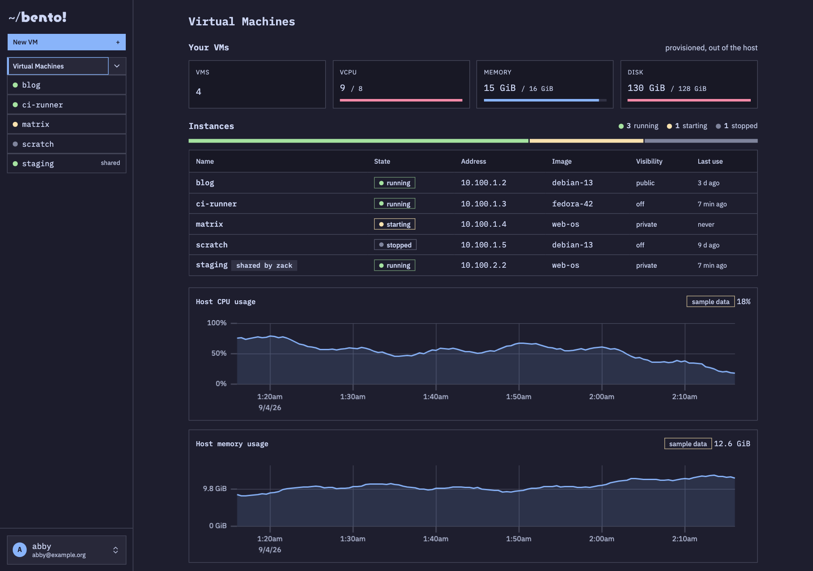
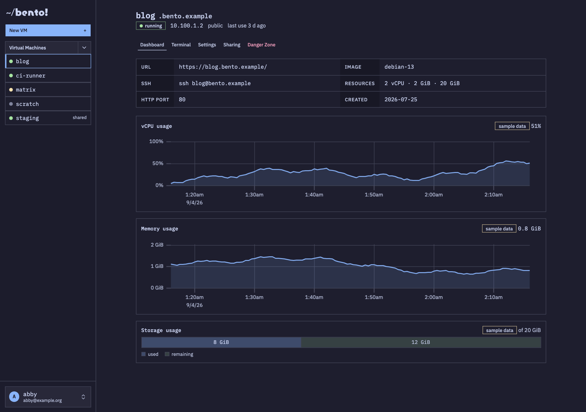
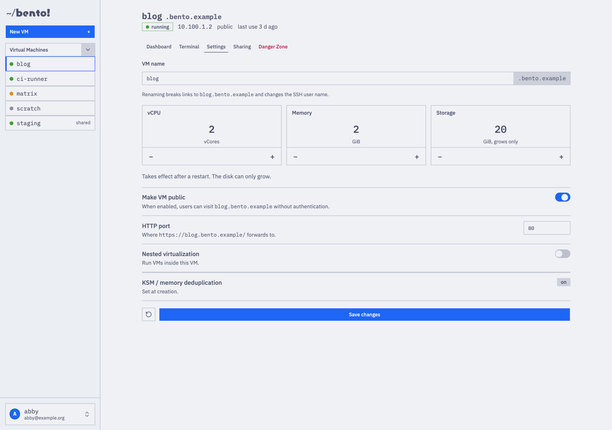
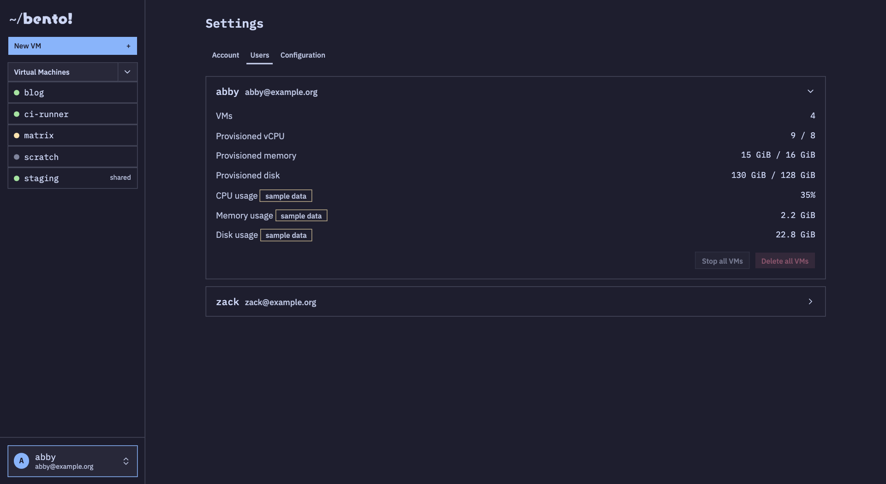
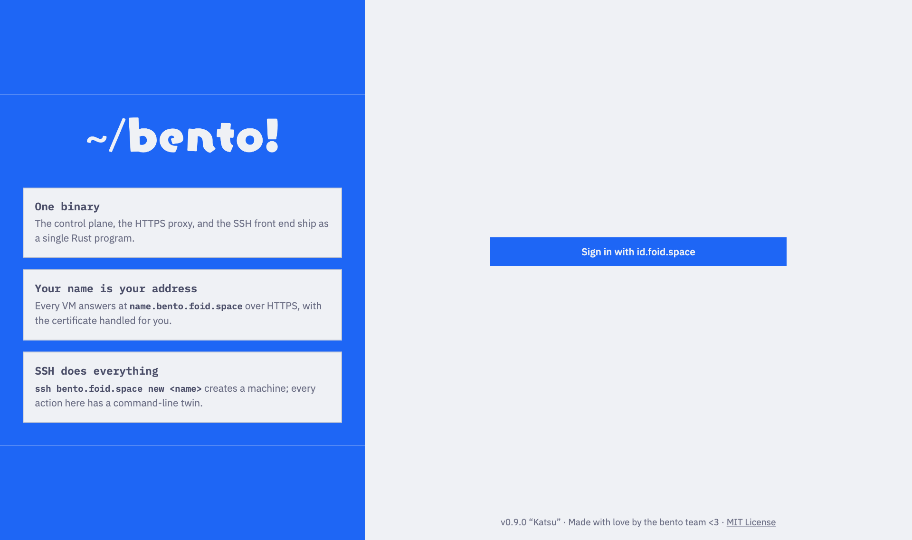

# Bento

Bento runs Linux virtual machines on one libvirt/KVM host. A user creates
a machine over SSH or in the web dashboard. Bento gives the machine a
static address on the owner's private /24, boots it from an allowlisted
cloud image with cloud-init, and publishes it as `NAME.<your-domain>` over
HTTPS and as `ssh NAME@<your-domain>`. One binary, `bentod`, runs
everything.

[SPEC.md](SPEC.md) is the system specification. It is authoritative. Read
it before you change anything. [DEPLOYING.md](DEPLOYING.md) is the runbook
for a new host.

## Screenshots

The dashboard, over demo data. The charts show sample data until the
host sampler lands (issue #16).











## Operator quickstart

**DNS** (SPEC 7.1). Create two `A` records that point at the host:

1. `bento.example.org`
2. `*.bento.example.org`

**Host.** You need a Linux machine with `/dev/kvm`, `libvirtd` on
`qemu:///system`, and `qemu-img`, `xorriso`, and `nft` on `PATH`. Run
`bentod` as a user in the `libvirt` group. `bentod serve` refuses to start
if a requirement is missing (SPEC 4.2). Bootc OCI images also need rootful
Podman, because Bento builds their disks in a privileged container.

**Config.** Copy [`bento.example.toml`](bento.example.toml) to
`/etc/bento/bento.toml`. Set `base_domain`, the `[acme]` Cloudflare token
for the wildcard certificate, the `[oidc]` provider for the dashboard, and
one `[[images]]` entry. Then download the images:

```
bentod fetch-images
```

**Three processes** (SPEC 4). Run each one under systemd with
`Restart=on-failure` and `After=libvirtd.service`:

```
bentod serve    # control plane: database, policy, restore, dashboard (port 10080)
bentod proxy    # HTTPS proxy: port 443 and ports 3000-9999
bentod sshd     # SSH frontend and CLI: port 22
```

`serve` owns the database. Back it up with `bentod dump-db`, never with a
file copy, together with the image and storage directories (SPEC 12.1).
`bentod reconcile` reports disagreements between libvirt and the database
and changes nothing. `bentod images` lists the images.

**`bento-monitor`** is a terminal screen for the same work. It installs
the binary, the directories, the configuration, and the units. It starts,
stops, and watches them. It is a shim over `systemctl`: it shows each
command, then runs it in your terminal. See `DEPLOYING.md` section 6.

**Users.** The first OIDC login for an identity creates the account and
its /24 (SPEC 13). To use the command line, a user runs
`ssh bento.example.org` with an unknown key, opens the link it prints, and
confirms the fingerprint. Set `allow_signup = false` under `[oidc]` to
freeze the user list. Grant quota with a `quotas` row.

Names in `operators` can download the database and can add bootc OCI
images while Bento runs, from the dashboard or over SSH:

```
ssh bento.example.org images add fedora-bootc quay.io/fedora/fedora-bootc:latest
```

An OCI image must boot on its own, with a kernel, cloud-init NoCloud, and
`qemu-guest-agent` inside. Bento checks this before the build. Operators
choose the input to a privileged build, so operator access is an
effective path to host root.

## Development quickstart

You need Rust nightly (`rust-toolchain.toml`) and a C compiler for the
bundled SQLite. You do not need Node, cmake, or clang. The dashboard is
server-rendered, and every TLS user is pinned to the `ring` provider.

```
make build       # target/release/bentod and target/release/bento-monitor
make monitor     # build and start the terminal screen against this host
make check       # cargo clippy -D warnings && cargo test --workspace
make unit        # the in-process tests only
make e2e         # the end-to-end suite: the real binary, over real sockets
```

Everything that touches the host sits behind a small trait with an
in-memory fake, so the unit tests run anywhere. `bentod/tests/e2e/` runs
the real binary against a fake libvirtd on a unix socket. `TESTING.md`
says what is real and what is substituted. CI runs both tiers on x86_64
and arm64.

- `bentod`: subcommand dispatch and the wiring of all crates.
- `bento-monitor`: the operator's terminal screen.
- `crates/types`, `crates/config`, `crates/store`: domain types, TOML
  configuration, and SQLite persistence (SPEC 11, 12).
- `crates/hypervisor`, `crates/images`, `crates/cloudinit`,
  `crates/network`, `crates/lifecycle`: host-side machinery (SPEC 5, 6,
  11). The hypervisor crate speaks libvirt's XDR RPC directly and binds no
  C library.
- `crates/sshfront`, `crates/cli`: SSH frontend and command line (SPEC 10,
  15).
- `crates/proxy`, `crates/tlscert`: HTTP proxy and wildcard TLS (SPEC 8,
  9).
- `crates/auth`, `crates/api`, `crates/dashboard`: identity, the JSON API,
  the dashboard pages and templates, and the dashboard's static assets
  (SPEC 13, 14).

## Status

Built to SPEC v0.9. Every crate has unit tests against fakes, and the
end-to-end suite drives the real binary through the instance lifecycle.
The system has **not** run against a live libvirtd. No guest has booted
in a test. The nftables ruleset and ACME issuance run only against fakes.

Known gaps:

- `console` is not wired. Use `ssh NAME@<domain>`.
- `rename` needs a stopped machine, because the libvirt domain carries
  the name.
- The three processes share one SQLite database over WAL. The SSH
  frontend also writes to it, which SPEC 4 reserves for the control plane.
- Dashboard sessions live in `serve` memory. A restart signs dashboard
  users out. API tokens are not affected.
- Only OIDC creates accounts. Without a working provider, nobody can sign
  up, over the web or over SSH.
